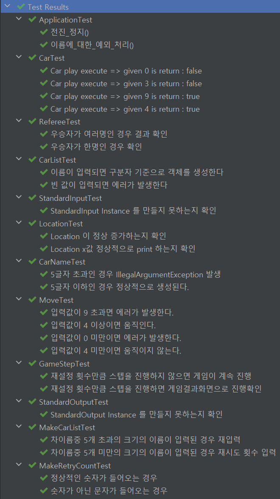

# 자동차 경주게임

## 목표
- 1주차
  - 함수를 분리하는 것이 목표
- 2주차
  - 클래스를 분리하는 것이 목표
  - TDD 방식으로 개발

## 기능 요구 사항
- [x] 주어진 횟수 동안 n대의 자동차는 전진 또는 멈출 수 있다.
- [x] 각 자동차에 이름을 부여할 수 있다. 전진하는 자동차를 출력할 때 자동차 이름을 같이 출력한다.
- [x] 자동차 이름은 쉼표(,)를 기준으로 구분하며 이름은 5자 이하만 가능하다.
- [x] 사용자는 몇 번의 이동을 할 것인지를 입력할 수 있어야 한다.
- [x] 전진하는 조건은 0에서 9사이에서 random 값을 구한 후 random 값이 4 이상일 경우 전진하고, 3이하의 값이면 멈춘다.
- [x] 자동차 경주 게임을 완료한 후 누가 우승했는지를 알려준다.
- [x] 우승자가 한 명 이상일 경우, 쉼표(,)로 이름을 구분해 출력한다.
- [x] 사용자가 잘못된 값을 입력할 경우 IllegalArgumentException 을 발생시키고, "[ERROR]"로 시작하는 에러 메시지를 출력 후 그 부분부터 입력을 다시 받는다.
- [x] Exception 이 아닌 IllegalArgumentException, IllegalStateException 등과 같은 명확한 유형을 처리한다.

## 기능 목록
- [x] 랜덤값을 확인하고 이동할지 말지에 대한 기능 구현
- [x] 자동차의 이름이 적절한지 확인하는 기능
- [x] 사용자 입출력 처리하는 포트 구현
- [x] 자동차의 위치를 증가시키고 알맞은 값을 출력하는 기능 구현
- [x] 자동차의 기능 구현
- [x] 자동차 일급 컬렉션 구현
- [x] 우승자를 확인하는 심판 기능 구현
- [x] 게임 시스템 구현

## 테스트 수행 결과
